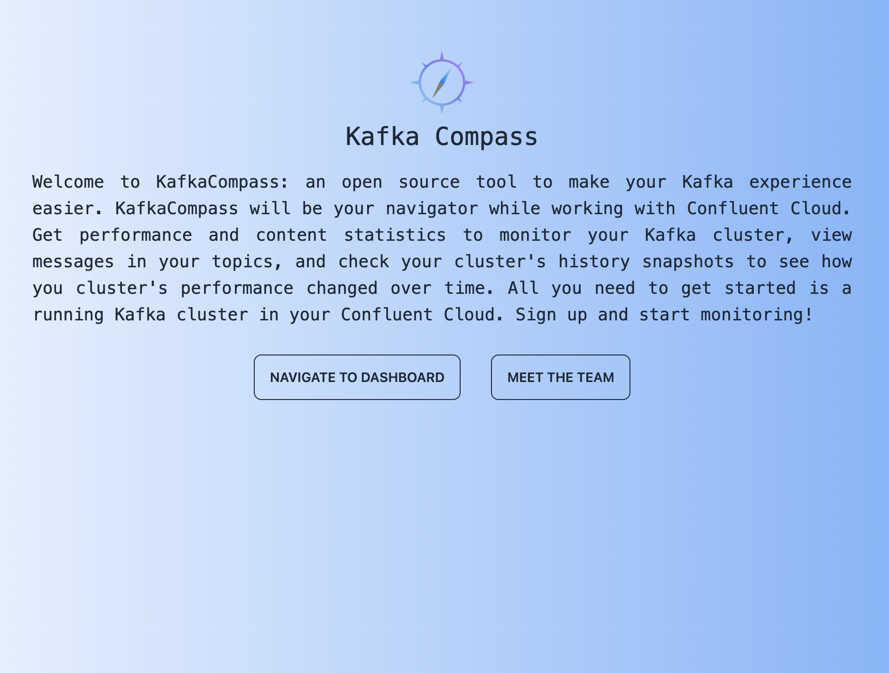
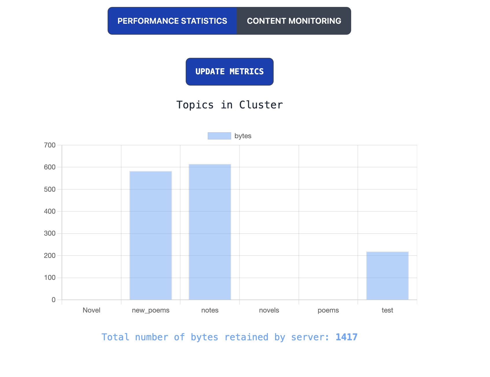
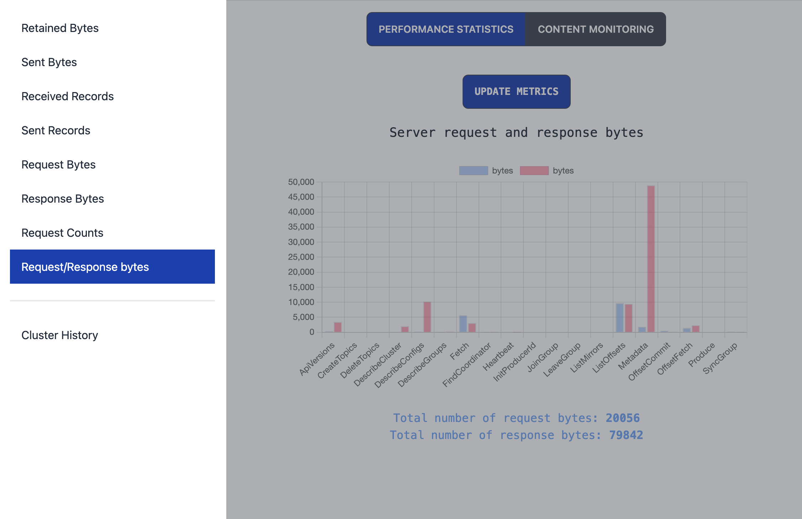
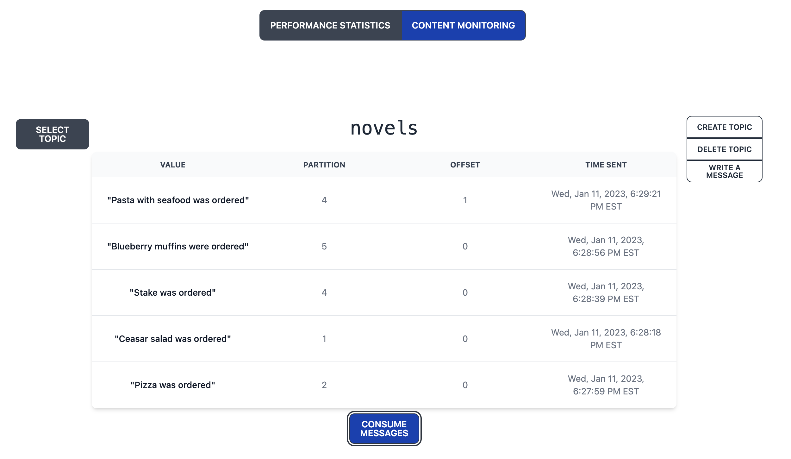

# KafkaCompass

Welcome to **KafkaCompass Alpha**, a GUI specialized in monitoring your Confluent Cloud Kafka clusters. Get performance and content statistics, view messages in your topics, and check your cluster's history snapshots to see how you cluster's performance changed over time. We're excited to have you as a user, and we can't wait to help you navigate and optimize your Kafka clusters!

You can start with our web application or run KafkaCompass locally.

# Guide

## Getting Started 🧭

- To get started with KafkaCompass on web, make sure to sign up first and add your clusters. If you are running the app locally, you will need to add some additional configurations. Follow the instructions in the “Running Locally” section to set this up.

 

- Once you’ve signed up, you will be greeted by your dashboard. It’s important to note that KafkaCompass is designed to work with Confluent Cloud Kafka clusters, so to get started, you will need to have a cluster already running in the Confluent Cloud. Follow the steps [here](https://docs.confluent.io/cloud/current/get-started/index.html#quick-start-for-ccloud) to set this up.

- Once you have a running cluster, you can now link it to the application. Click on the “Add Cluster” button in the nav-bar at the top of the dashboard. Fill out all the fields, checking carefully for accuracy, and press submit. Your cluster information will now be encrypted and stored securely in your user profile.
  - Having trouble finding some of your cluster information? Here is where each piece of info can be found:
    - **Cluster name**: Up to you! Create an alias to help you remember this specific cluster.
    - **API Key** and **API Secret**: On Confluent Cloud, navigate to your cluster. In the sidebar on the left, click on "API Keys," located under Cluster Overview. If you don't already have an API Key, generate a new one, making sure to securely save your key and secret - the secret will no longer be viewable after creation.
    - **Cloud Key** and **Cloud Secret**: In the top navbar of Confluent Cloud, click the three stacked lines on the right corner. This will open a menu, where you can click "Cloud API keys." Similar to the previous step, if you have not already generated a Cloud Key, create a new one and securely save the key and secret.
    - **REST Endpoint**, **Cluster ID**, and **Bootstrap Server**: Return to your cluster's page on Confluent Cloud. In the sidebar on the left, click "Cluster Settings" under "Cluster Overview." The information will be displayed in the boxes for "Identification" and "Endpoints."

## View Modes

Now that you have a cluster stored in your account, you will be able to see performance and content information for the cluster. KafkaCompass has two primary viewing modes: **Performance Statistics** and **Content Monitoring**.

    

### Performance Statistics

- The default mode is Performance Statistics, which initially shows a chart displaying retained bytes per topic in the first cluster of your profile. To switch charts, press the **Change Metrics** button in the nav-bar, which will open a side menu. In the side menu, you can choose the desired statistic you would like to view. If you would like to update these metrics to the most recent state of your cluster, simply press the **Update Cluster** button on the dashboard.

    

- Once you have multiple clusters added to your profile, you can switch between these clusters by using the **Switch Cluster** button on the dashboard. Simply click on the desired cluster in the dropdown menu, and all statistics will be refreshed for this selected cluster.

### Content Monitoring

- In Content Monitoring, you can consume and see the current messages in your selected cluster. To view messages, select the desired topic in your cluster via the dropdown menu, located to the left of the chart. Once you have selected a topic, simply click **Consume Messages**, and the most recent messages in the given topic of your cluster will be displayed.

    

- Additionally, you can change the configuration of your cluster. You can add or delete topics, as well as write new messages to a selected topic. In Content Monitoring, you will be able to see these changes nearly instantly. However, it’s worth noting that in “View Cluster” mode, it may take around 3-5 minutes for the addition or deletion of topics to show up, due to how Confluent updates cluster statistics on their end.

## Running Locally

To run KafkaCompass on your on your local machine, you need to add some additional files after forking and cloning the repository. These steps will help you create your own database and encryption functions so you can take advantage of all of KafkaCompass's backend functionality.

### Configuring Your Repository 🔧

- **credentials.js**

  - Under the "server" directory, create a new file called "credentials.js." This file will allow you to connect your NoSQL database (we recommend using MongoDB). If you are not sure how to set up a database on MongoDB, check out their [guide](https://www.mongodb.com/basics/create-database).
  - Following the format on "credentials.js.example," copy and paste the link to your database URI. KafkaCompass is now connected to your database!

- **encryption.js**

  - In order to encrypt and decrypt information from your database, you will need to set up functionality to do so. Using the template on "encryption.js.example," create your own "encryption.js" file.
  - For the security of our own application as well as yours, you will need to implement your own encryption and decryption functions. If you are not sure where to start with this, we recommend looking at some algorithms [here](https://www.labnol.org/code/encrypt-decrypt-javascript-200307).

### Running the application

- Once credentials.js and encryption.js are set up, your application is now good to go! Install all dependencies with "npm install," then use "npm run dev" to run in development mode. Alternatively, use "npm run build" then "npm start" to run in production mode.

# Contributing to KafkaCompass

KafkaCompass is open source, and we would love to see contributions from the community! If you would like to contribute, submit a pull request to the "dev" branch of the original repository. Additionally, if you notice any issues with the application, please add an entry to the "issues" section of the repository.

## Meet the team 💻

<ul>
<li><b>Kevin Dooley:</b> <a href="https://github.com/kjdooley1">GitHub</a> & <a href="https://www.linkedin.com/in/kjdooley1/">LinkedIn</a></li>
<li><b>Dison Ruan:</b> <a href="https://github.com/fattyduck123">GitHub</a> & <a href="https://www.linkedin.com/in/dison-ruan-2b484953/">LinkedIn</a></li>
<li><b>Daria Mordvinov: </b><a href="https://github.com/DariaMordvinov">GitHub</a> & <a href="https://www.linkedin.com/in/dariamordvinov/">LinkedIn</a></li>
<li><b>Ryan Zarou:</b> <a href="https://github.com/rzarou">GitHub</a> & <a href="https://www.linkedin.com/in/rzarou/">LinkedIn</a></li>
<li><b>Jason Kuyper:</b> <a href="https://github.com/jasonkuyper">GitHub</a> & <a href="www.linkedin.com/in/jason-kuyper">LinkedIn</a></li>
</ul>
